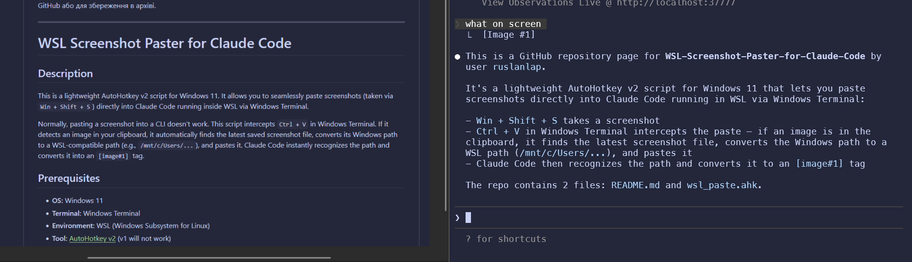
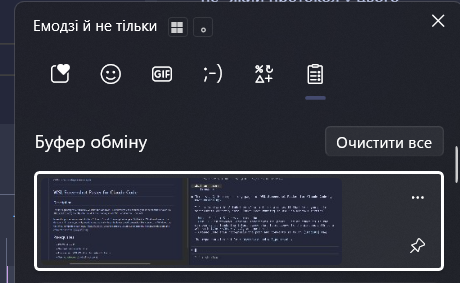

# WSL Screenshot Paster for Claude Code

## Quick Start (EXE)

1. Запусти `wsl_paste.exe`.
2. Відкрий Windows Terminal (або VS Code / Cursor) з Claude Code у WSL.
3. Роби скрін (`Win + Shift + S`) і вставляй `Ctrl + V`.

Готово: вставка в термінал працює без додаткових налаштувань.

## Description

This is a lightweight AutoHotkey v2 script for Windows 11. It allows you to seamlessly paste screenshots (taken via `Win + Shift + S`) directly into Claude Code running inside WSL via Windows Terminal, VS Code, or Cursor.

Normally, pasting a screenshot into a CLI doesn't work. This script intercepts `Ctrl + V` in Windows Terminal. If it detects an image in your clipboard, it automatically finds the latest saved screenshot file, converts its Windows path to a WSL-compatible path (e.g., `/mnt/c/Users/...`), and pastes it. Claude Code instantly recognizes the path and converts it into an `[image#1]` tag.

## Prerequisites

* **OS:** Windows 11
* **Terminal:** Windows Terminal, VS Code, or Cursor
* **Environment:** WSL (Windows Subsystem for Linux)
* **Tool:** `wsl_paste.exe` (recommended) or [AutoHotkey v2](https://www.autohotkey.com/) for `.ahk` script mode

## Setup & Installation

### Option 1 (recommended)

1. Run `wsl_paste.exe`.
2. Keep it running in tray while you work in terminal.

### Option 2 (script mode)

1. Install AutoHotkey v2.
2. Run `wsl_paste.ahk`.

## How to Use

1. Take a screenshot using the standard Windows Snipping Tool (`Win + Shift + S`).
2. Focus your terminal window (Windows Terminal, VS Code, or Cursor) where Claude Code is running.
3. Press `Ctrl + V`.
4. *Magic happens:* The script fetches the correct WSL path, pastes it, and instantly restores your original image to the clipboard so you can still paste it elsewhere!

## Screenshots

## Autostart on Boot (Optional)

If you want this script to run automatically every time you start your PC:

1. Press `Win + R` to open the Run dialog.
2. Type `shell:startup` and press Enter.
3. Create a shortcut to `wsl_paste.exe` (or `wsl_paste.ahk`) and place it in this Startup folder.